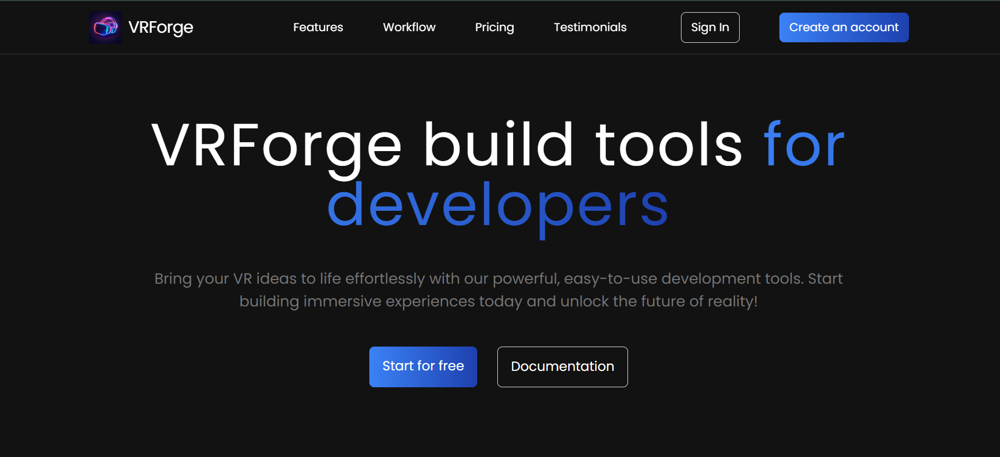
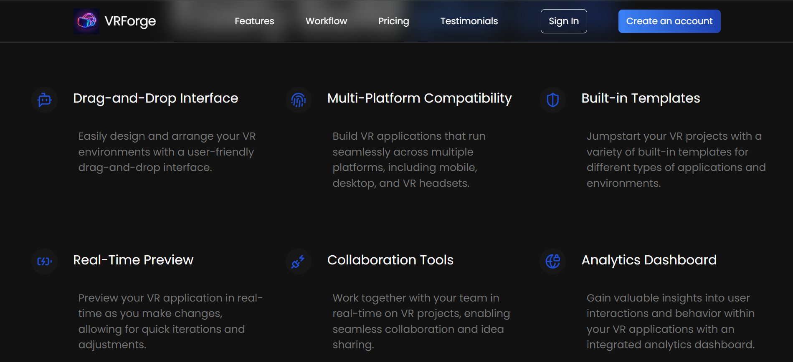
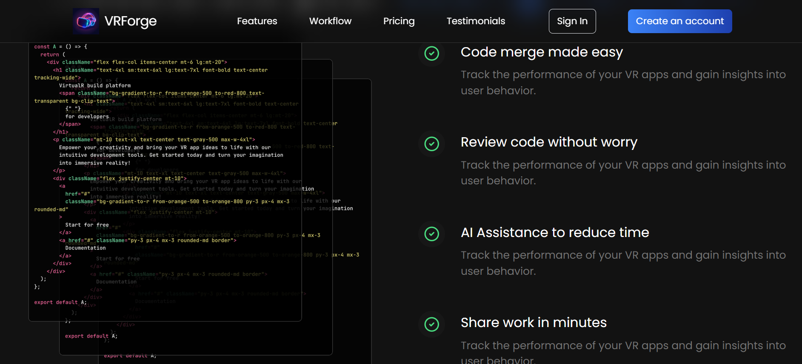

# VRForge – Responsive Landing Page (React + Tailwind CSS)

**VRForge** is a fully responsive and modern landing page built using **React**, **Tailwind CSS**, and **Vite**. It’s designed for a developer tool product offering VR application development features. The UI is clean, professional, and optimized for performance and responsiveness across all devices.

## 🚀 Features

- ⚡ Built with **React** and **Vite** for fast performance
- 🎨 Styled using **Tailwind CSS** for easy customization and responsive design
- 📱 Fully responsive layout (mobile, tablet, desktop)
- 🧰 Modular components and clean folder structure
- 📚 Sections included: Hero, Features, Testimonials, Pricing, Footer, and more
- 🌐 Optimized for deployment

## 📁 Tech Stack

- **React** – Frontend library
- **Tailwind CSS** – Utility-first CSS framework
- **Vite** – Lightning-fast build tool
- **GitHub** – Version control & deployment

## 📸 Screenshots

### 🖼️ Hero Section


### ⚙️ Features Section


### 💬 Testimonials and Pricing



## 🛠️ Getting Started

To run the project locally:

```bash
git clone https://github.com/itsAnkit2153/VRForge.git
cd VRForge
npm install
npm run dev
